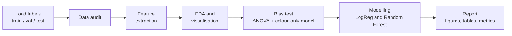

# Shapes Image Dataset: Data Audit, EDA & Classification


> An end-to-end data analysis of a synthetic image dataset: **data quality audit → feature engineering → exploratory analysis → statistical bias testing → machine learning → reporting**, using interpretable features instead of a black-box model.

**Author:** Tanishka | **Role:** Data Analyst Intern, IBM

---

## Highlights

| Metric | Result |
|---|---|
| Images analysed | **5,400** (64 × 64 RGB, 6 classes, 900 each) |
| Data quality issues found | **0** (no missing, corrupt, duplicate or leaked images) |
| Best model | **Random Forest, 100% test accuracy** |
| Simple baseline | Logistic Regression, 99.9% test accuracy |
| Colour-only sanity check | 16.9% accuracy, which is chance level, so colour does not leak the label |
| Features engineered | 21 interpretable features (colour, geometry, radial signature) |
| Run time | About 30 seconds end to end |

---

## Table of Contents
- [Overview](#overview)
- [Workflow](#workflow)
- [Dataset](#dataset)
- [Visual Results](#visual-results)
- [Methodology](#methodology)
- [Results](#results)
- [Key Insights](#key-insights)
- [Getting Started](#getting-started)
- [Project Structure](#project-structure)
- [Limitations](#limitations)
- [Future Work](#future-work)
- [Tech Stack](#tech-stack)

---

## Overview

**Question this project answers:**
*Is the dataset clean, balanced and free of shortcuts, and can the shape in each image be identified from a small set of interpretable features?*

**Objectives**
1. Audit the dataset for missing, corrupt, duplicate or leaked images.
2. Convert raw pixels into human-readable numeric features (colour and geometry).
3. Explore how those features differ across the six classes.
4. Test statistically whether colour, a nuisance variable, leaks information about the label.
5. Train and compare classical ML models and explain which features drive the predictions.

Classical ML on hand-crafted features was chosen on purpose over a deep network: every feature can be explained to a non-technical stakeholder, which is what a business-facing analysis needs.

## Workflow



## Dataset

| Property | Value |
|---|---|
| Images | 5,400 PNG files, 64 × 64 RGB |
| Classes | circle, square, triangle, star, pentagon, cross (900 each) |
| Splits | train 3,780 / validation 810 / test 810 (stratified 70/15/15) |
| Variation | random colours (with enforced contrast), position, size, rotation, blur, Gaussian noise |
| Labels | `train_labels.csv`, `val_labels.csv`, `test_labels.csv` with columns `filepath, label, label_id` |

The data is **synthetic and fully reproducible**: `generate_dataset.py` recreates the exact same images (seed = 42), so the images themselves are not stored in this repository.

Folder layout after generating it:

```
shapes_dataset/
├── train/
│   ├── circle/circle_0000.png
│   ├── square/...
│   └── ...
├── val/
├── test/
├── train_labels.csv
├── val_labels.csv
├── test_labels.csv
└── README.txt
```

## Visual Results

### Sample images (8 per class)


### Geometric features separate the classes


### Colour is independent of class


### PCA projection of shape features


### Test-set confusion matrix


### What the model relies on


All 9 charts are in [`results/figures/`](results/figures/).

## Methodology

### 1. Data audit
Checks on all 5,400 records: missing and corrupt files, image size and colour mode, MD5-based duplicate detection, folder-name vs label consistency, null values, class imbalance, and **cross-split leakage** (the same image appearing in more than one split).

### 2. Feature engineering
Each image is segmented into foreground and background. The background colour is the median of the border pixels, and the foreground is every pixel far from that colour, cleaned with morphological opening and largest-component selection.

| Group | Features | Purpose |
|---|---|---|
| Colour and quality | foreground and background RGB, brightness, luminance contrast, noise level, sharpness | Nuisance variables used to test for bias |
| Geometry | `area_frac`, `extent`, `bbox_aspect`, `circularity`, `solidity`, `eccentricity` | Overall form of the shape |
| Radial signature | `radial_mean`, `radial_cv`, `radial_min_max`, `n_vertices` | Distance from centroid to boundary by angle; the peak count estimates the number of corners |

The geometric features are invariant to rotation, scale and colour, which is why they suit this dataset.

### 3. Exploratory analysis
Class and split balance, sample grid, per-class boxplots, colour distributions, correlation heatmap and a PCA projection.

### 4. Statistical bias test
A one-way ANOVA of each colour and quality feature across the six classes. A colour-only Random Forest is also trained: if it beat random guessing (16.7%), colour would be leaking the label.

### 5. Modelling
Logistic Regression (scaled) and Random Forest (300 trees) trained on the shape features, evaluated on validation and held-out test sets, plus 5-fold stratified cross-validation on the training split. The best model is picked on validation accuracy, with cross-validation accuracy as the tie-breaker.

## Results

### Data audit

| Check | Result |
|---|---|
| Missing / corrupt files | 0 / 0 |
| Image size / mode | all 64 × 64 / RGB |
| Duplicate images | 0 |
| Cross-split leakage | 0 |
| Label-folder mismatches / null values | 0 / 0 |
| Class imbalance ratio (max / min) | 1.0 (perfectly balanced) |

### Model performance

| Model | Features | Val acc. | Test acc. | Test macro-F1 | 5-fold CV acc. |
|---|---|---|---|---|---|
| Colour-only Random Forest (bias check) | colour + quality | 0.185 | 0.169 | 0.168 | n/a |
| Logistic Regression | shape | 1.000 | 0.999 | 0.999 | 0.9997 ± 0.0005 |
| **Random Forest** | shape | **1.000** | **1.000** | **1.000** | **1.000 ± 0.000** |

Random guessing would give 0.167.

### Top features (Random Forest importance)

| Rank | Feature | Importance |
|---|---|---|
| 1 | `n_vertices` | 0.25 |
| 2 | `radial_cv` | 0.20 |
| 3 | `radial_min_max` | 0.19 |
| 4 | `solidity` | 0.14 |
| 5 | `extent` | 0.13 |

## Key Insights

1. **The dataset is clean and well designed.** No missing, corrupt, duplicate or leaked images, and every class is perfectly balanced in every split.
2. **Colour carries no information about the class.** The colour-only model scores at chance level (0.169 vs 0.167), and ANOVA finds no significant class differences for any colour feature (all p > 0.05).
3. **`sharpness` does differ by class (p < 0.001), but this is expected, not a bias.** It is computed from the image Laplacian, which depends on the length of the shape's edge, so it reflects geometry rather than a colour or background shortcut.
4. **Corner count and radial variation separate the classes.** Circles have no corners and a near-constant radius; triangles, squares and pentagons have 3, 4 and 5 corners; stars and crosses have low `solidity` because their outlines are concave.
5. **Simple, interpretable models are enough.** A linear model reaches 99.9% test accuracy, so a deep network would add complexity without benefit on this data.

## Getting Started

**Prerequisites:** Python 3.9 or newer and Git.

```bash
# 1. Clone the repository
git clone https://github.com/YOUR_USERNAME/shapes-image-analysis.git
cd shapes-image-analysis

# 2. (Optional) create a virtual environment
python -m venv venv
source venv/bin/activate        # Windows: venv\Scripts\activate

# 3. Install dependencies
pip install -r requirements.txt

# 4. Generate the dataset (deterministic, seed = 42)
python generate_dataset.py ./shapes_dataset

# 5. Run the full analysis
python shapes_analysis.py --data-dir ./shapes_dataset --out-dir ./results
```

Replace `YOUR_USERNAME` and the repository name in step 1 with your own.

**Command-line options**

| Argument | Default | Description |
|---|---|---|
| `--data-dir` | `./shapes_dataset` | Folder containing the split folders and label CSVs |
| `--out-dir` | `./results` | Where figures, tables and metrics are saved |
| `--sample N` | `0` (all) | Use only N images per class per split, for a quick test run |
| `--seed` | `42` | Random seed for models and cross-validation |

## Project Structure

```
.
├── README.md                 # project documentation
├── requirements.txt          # Python dependencies
├── generate_dataset.py       # regenerates the dataset from scratch
├── shapes_analysis.py        # main analysis pipeline
└── results/
    ├── summary.txt           # one-page text summary
    ├── metrics.json          # audit results and all model metrics
    ├── figures/              # 9 PNG charts
    └── tables/               # features.csv, ANOVA, classification report, ...
```

## Limitations

- **The near-perfect accuracy reflects an easy, clean synthetic dataset**, not real-world performance. Real images with occlusion, lighting changes, texture or clutter would be much harder.
- Shapes are drawn with high contrast on a flat background, which makes segmentation trivial.
- Pixel-based `circularity` and `solidity` are approximations: values slightly above 1 occur because perimeter and hull area are measured on a discrete pixel grid. They are used as relative measures between classes, not exact geometric quantities.
- Single dataset and a single random seed for the main split.

## Future Work

- Add harder variations (overlapping shapes, textured backgrounds, low contrast, partial occlusion) and re-test the feature approach.
- Compare against a small CNN and report where interpretable features stop being enough.
- Build a Streamlit or IBM Cognos dashboard for interactive exploration of the feature table.
- Package the pipeline as a scheduled job with automated data-quality alerts.

## Tech Stack

Python 3 · NumPy · pandas · Pillow · SciPy · scikit-learn · Matplotlib · Seaborn

---

*Built by Tanishka as part of a Data Analyst internship at IBM.*
